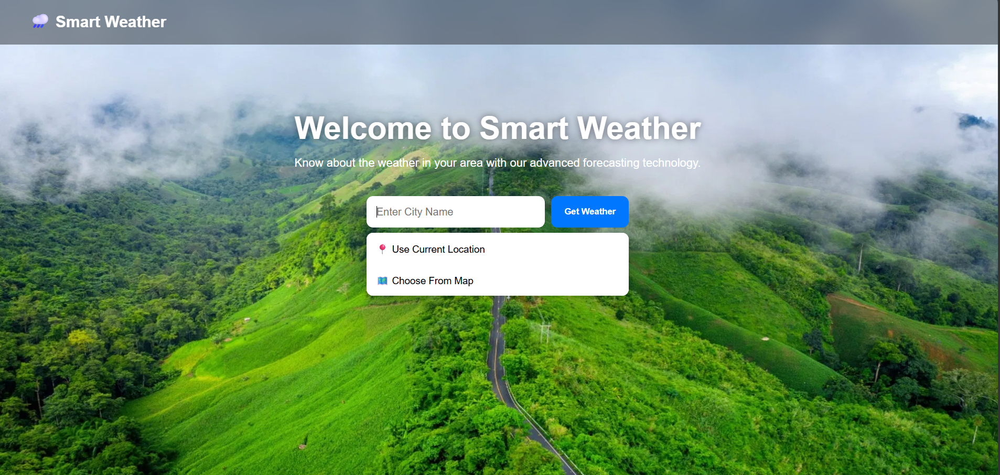
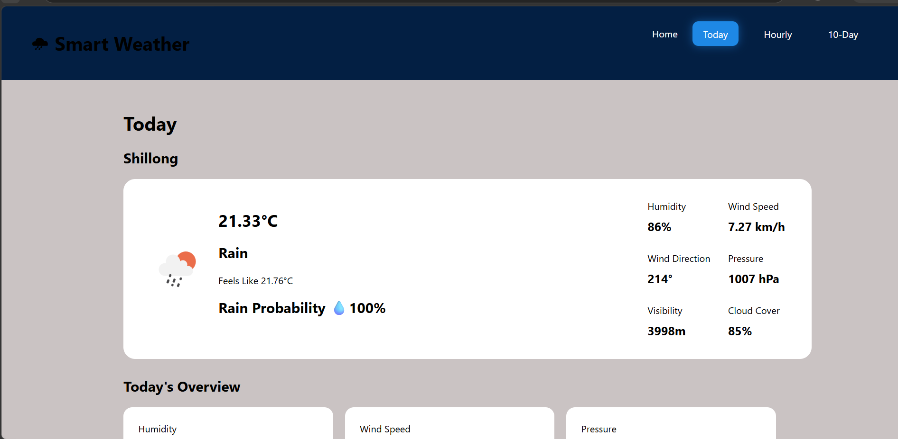
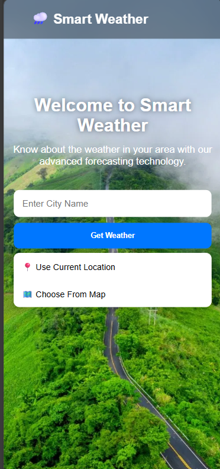

# 🌧 Smart Weather Dashboard

A modern weather monitoring and rain prediction system built with **FastAPI**, **HTML**, **CSS**, and **JavaScript**. The application provides real-time weather data, air quality information, rain probability, nearby rain analysis, hourly forecasts, and a 10-day weather forecast in a responsive dashboard.

---


## Live Demo
URL https://smart-rain-prediction-system.onrender.com


## 📌 Features

### 🌤 Current Weather

* Real-time weather information
* Temperature
* Feels-like temperature
* Humidity
* Wind speed
* Wind direction
* Atmospheric pressure
* Visibility
* Cloud coverage

### 💧 Rain Probability

* Displays the probability of rainfall for the selected location.

### 🌦 Nearby Rain Analysis

* Detects nearby rainy locations.
* Calculates the nearest rain system.
* Estimates rain arrival time.
* Displays confidence level for rain prediction.

### 🌫 Air Quality Index (AQI)

* Shows air quality status for the selected location.

### ⏰ Hourly Forecast

* Weather forecast for the next 24 hours.
* Temperature
* RealFeel temperature
* Rain probability

### 📅 10-Day Forecast

* Daily weather forecast.
* Maximum temperature
* Minimum temperature
* Rain probability

### 📱 Responsive Design

* Optimized for desktop and mobile devices.

### 📍 Location Support

* Search weather by city.
* Use current device location.
* Select location from an interactive map.

---

## 🛠 Technologies Used

### Backend

* FastAPI
* Python
* Requests

### Frontend

* HTML5
* CSS3
* JavaScript

### APIs

* OpenWeather API
* OpenWeather Air Pollution API
* OpenWeather Forecast API

### Mapping

* Leaflet.js

---

## 📂 Project Structure

```text
Smart-Weather-Dashboard/
│
├── static/
│   ├── dashboard.css
│   ├── dashboard.js
│   ├── script.js
│   └── rainy_background.png
│
├── templates/
│   ├── home.html
│   └── dashboard.html
│
├── main.py
├── weather.py
├── nearby.py
├── prediction.py
├── distance.py
├── arrival_time.py
├── README.md
├── .env
└── .gitignore
```

---

## ⚙️ Installation

### 1. Clone Repository

```bash
git clone https://github.com/your-username/smart-weather-dashboard.git
cd smart-weather-dashboard
```

### 2. Create Virtual Environment

```bash
python -m venv venv
```

Activate Environment:

Windows

```bash
venv\Scripts\activate
```

Linux / Mac

```bash
source venv/bin/activate
```

### 3. Install Dependencies

```bash
pip install -r requirements.txt
```

### 4. Create .env File

```env
WEATHER_API_KEY=YOUR_OPENWEATHER_API_KEY
```

### 5. Run Application

```bash
uvicorn main:app --reload
```

Open:

```text
http://127.0.0.1:8000
```

---

## 🚀 How It Works

1. User selects a location using:

   * City search
   * Current location
   * Interactive map

2. The system fetches:

   * Current weather
   * AQI data
   * Forecast data

3. Nearby locations are analyzed to:

   * Detect rainfall activity
   * Calculate rain movement
   * Estimate rain arrival time

4. Results are displayed in a responsive dashboard.

---

## 📸 Screenshots

### Home Page



### Dashboard



### Mobile View



---

## 🎯 Future Improvements

* Weather alerts and notifications
* Severe weather warnings
* Radar visualization
* Historical weather data
* User authentication
* Weather analytics dashboard
* Multi-language support

---

## 👨‍💻 Author

Gopal Goswami

B.Tech Student | Python Developer | FastAPI Enthusiast

---

## 📄 License

This project is developed for educational and learning purposes.
